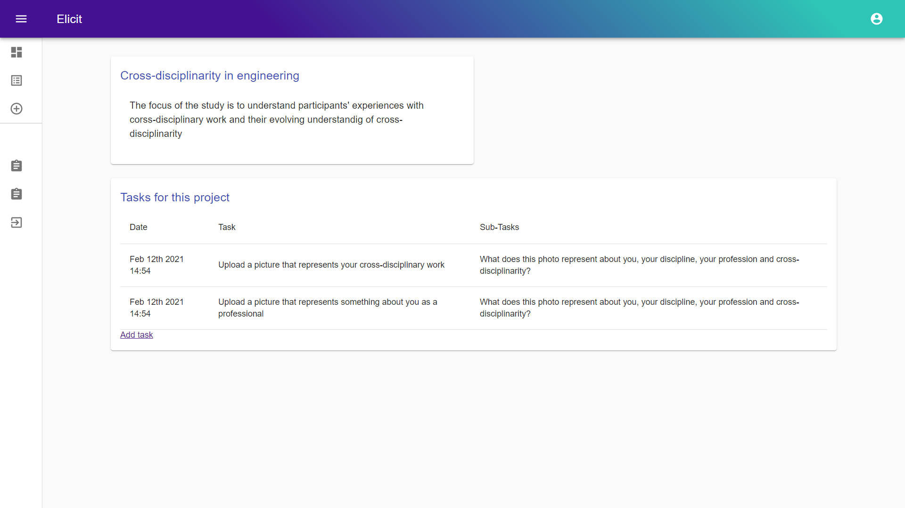

# Elicit
Elicit is a webApp project that tries to digitalize **photoelicitation methodologies**

## About Photoelicitation
Photo elicitation is a methodology that has been used extensively in Social Sciences. It allows the insertion of photographs or images into interviews inviting the participants to talk about them. The images can be supplied by the researchers or the participants depending on the research objectives.  With **Elicit this process can be done online**; researchers can assign tasks to participants: something simple like "take a picture of your favorite snack". **After taking the pictures participants will upload them to the platform**, where they will find follow-up questions to be answered and recorded. **Researchers have access to these answers and can separate them by projects, questions, or participants.** 

<h1 style="text-align: center">Dashboard</h1>

  

<h1 style="text-align: center">Participants: upload images and record audio</h1>

  
  

<h1 style="text-align: center">Review created tasks</h1>

  

## Tech Stack

Elicit was built using React, Material-UI and react-media-recorder acompained by a "serverless" architecture provided by Google's Firebase.